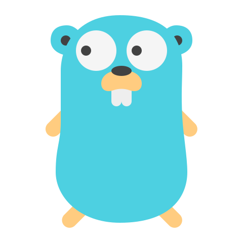
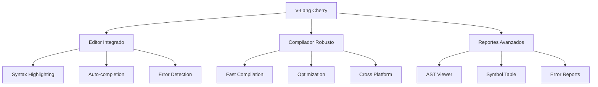
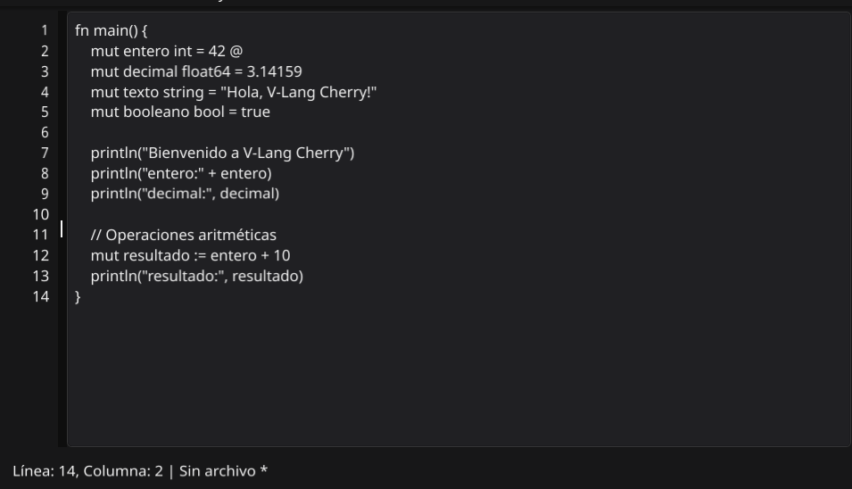
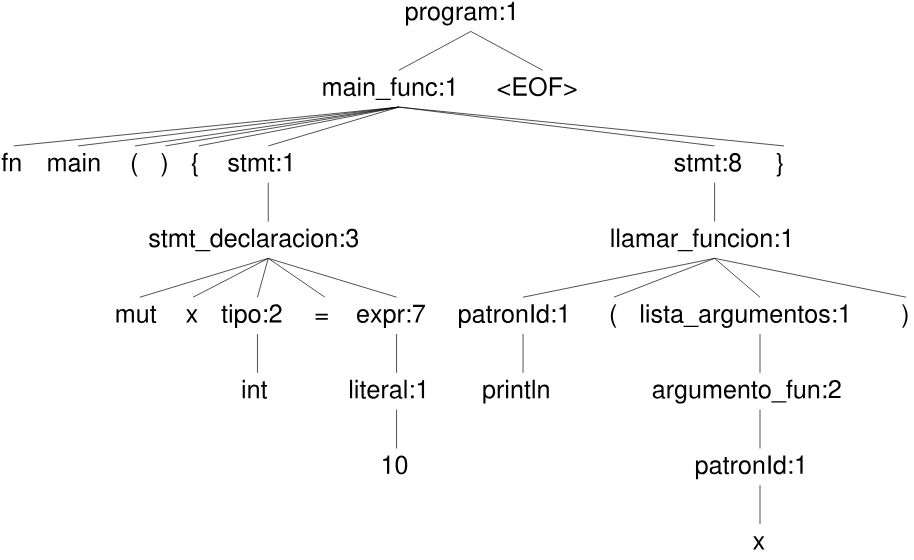
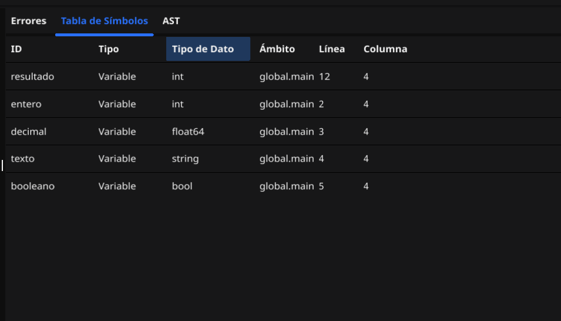
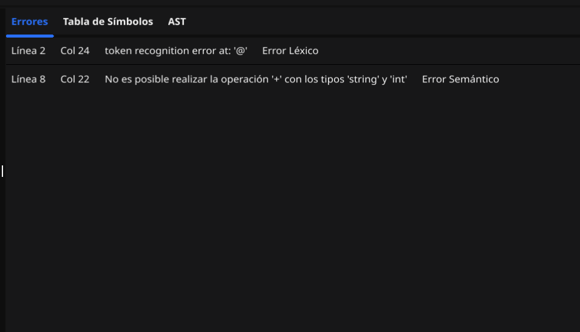
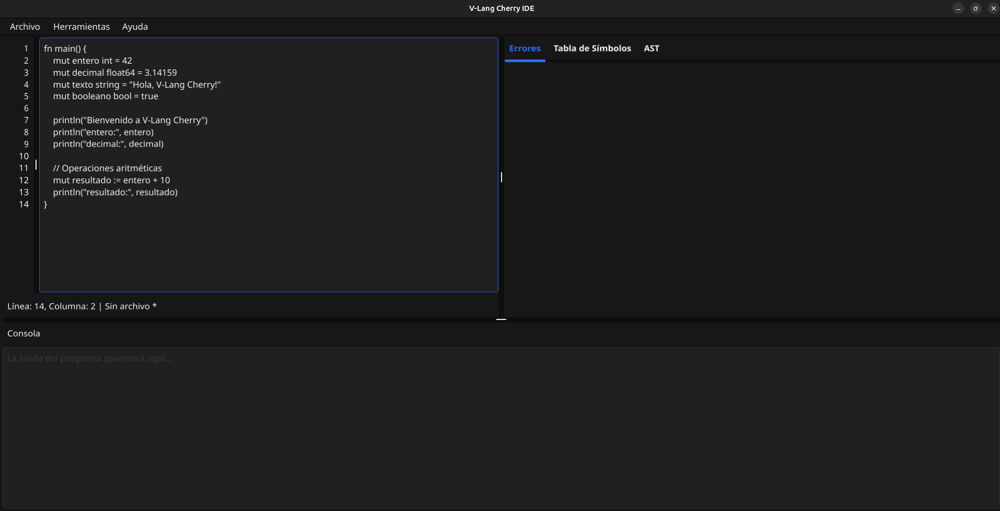
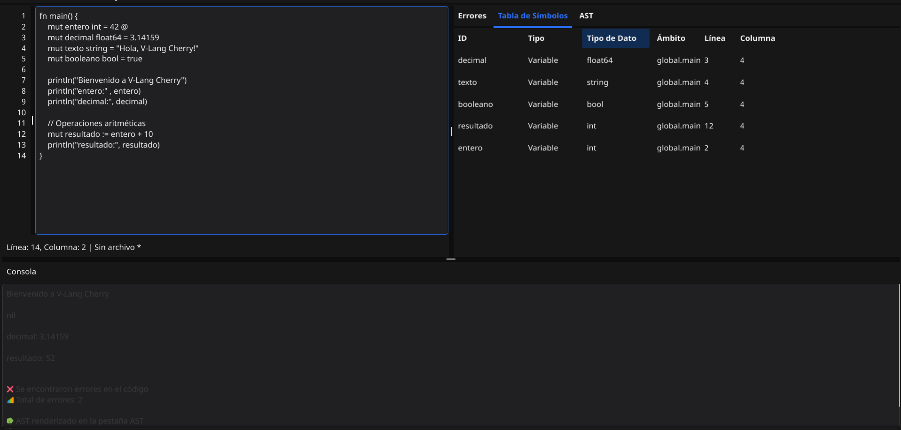

# 🍒 V-Lang Cherry: ¡Tu Código, Más Dulce y Potente! 🚀

<div align="center">
  
  
</div>

---

## ✨ ¿Qué es V-Lang Cherry?

<div align="center">
  
  > **"Un lenguaje de programación fresco y optimizado diseñado para simplificar la creación de aplicaciones robustas"**
  
  🎯 **Imagina la lógica, V-Lang Cherry la ejecuta!** 🎯
  
</div>

<div align="center">

### 🚀 Características Principales

| Característica | Descripción |
|:---:|:---:|
| ⚡ **Velocidad** | Compilación ultrarrápida con Go |
| 🔧 **Simplicidad** | Sintaxis intuitiva y fácil de aprender |
| 🛡️ **Robustez** | Detección temprana de errores |
| 🎨 **Flexibilidad** | Múltiples paradigmas de programación |

</div>

---

## 👨‍💻 El Equipo Genial detrás de Cherry

<div align="center">

### 🌟 **Los Arquitectos de la Revolución Cherry** 🌟

<table align="center">
<tr>
<td align="center" width="33%">

**🔥 JAIRO ADELSO GÓMEZ HERNÁNDEZ**  
*Backend Architect*  
[](https://github.com/JairoGH)

</td>
<td align="center" width="33%">

**⚡ ESTUARDO JOSUÉ VAQUIAX REYES**  
*Frontend Specialist*  
[](https://github.com/Jsue46)

</td>
<td align="center" width="33%">

**🚀 HÉCTOR DANIEL ORTIZ OSORIO**  
*Backend Architect*  
[](https://github.com/DaaNiieeL123)

</td>
</tr>
</table>

</div>

---

## 🛠️ Stack Tecnológico: ¡Nuestra Receta Secreta!

<div align="center">

### 💎 **Powered by Industry Leaders** 💎

<table align="center">
<tr>
<td align="center" width="33%">

### **Go** 🚀
<div align="center">
  
</div>

**¿Por qué Go?**
- ⚡ Compilación ultrarrápida
- 🔄 Concurrencia nativa  
- 🛡️ Memoria segura
- 📦 Binarios estáticos

</td>
<td align="center" width="33%">

### **ANTLR4** 🧩
<div align="center">
  
</div>

**Su Superpoder:**
- 🧠 Análisis léxico inteligente
- 📝 Parsing sintáctico robusto
- 🔍 Detección de errores precisa
- 🌍 Soporte multiplataforma

</td>
<td align="center" width="33%">

### **Fyne** ✨
<div align="center">
  
</div>

**La Magia Visual:**
- 🎨 UI nativa hermosa
- 📱 Cross-platform
- ⚡ Renderizado rápido
- 🎯 APIs simples

</td>
</tr>
</table>

</div>

---

## 🌟 Capacidades de V-Lang Cherry

<div align="center">

### 🎭 **¡Un Lenguaje que lo Tiene Todo!** 🎭

</div>



### 📋 Funcionalidades Implementadas

- [x] **🎨 Editor Integrado con Syntax Highlighting**
- [x] **🔢 Operaciones Aritméticas Avanzadas**  
- [x] **📊 Generación de AST Interactivo**
- [x] **🗂️ Tabla de Símbolos Dinámica**
- [x] **🚨 Sistema de Reportes de Errores**
- [x] **⚡ Compilación en Tiempo Real**

---

## 📸 Screenshots & Demo

<div align="center">

### 🖥️ **V-Lang Cherry en Acción** 🖥️

</div>

### 🎨 **Editor Principal**
<div align="center">
  
  <p><em>Editor con syntax highlighting, números de línea y detección de errores en tiempo real</em></p>
</div>

### 📊 **Visualizador AST**
<div align="center">
  
  <p><em>Representación gráfica del árbol de sintaxis abstracta (AST) generado</em></p>
</div>

### 📋 **Tabla de Símbolos**
<div align="center">
  
  <p><em>Tabla dinámica que muestra todas las variables, funciones y estructuras declaradas</em></p>
</div>

### 🚨 **Reportes de Errores**
<div align="center">
  
  <p><em>Sistema inteligente de detección y reporte de errores semánticos y sintácticos</em></p>
</div>

### 🖥️ **Interfaz Completa**
<div align="center">
  
  <p><em>Vista completa del IDE con todos los paneles y herramientas integradas</em></p>
</div>

### ⚡ **Compilación en Tiempo Real**
<div align="center">
  
  <p><em>Consola de salida mostrando los resultados de la ejecución del código</em></p>
</div>

---

## 🚀 Instalación Rápida

```bash
# Clona el repositorio
git clone https://github.com/JairoGH/OLC2_Proyecto1

# Navega al directorio
cd v-lang-cherry

# Compila el proyecto
go build -o cherry ./cmd/main.go

# ¡Ejecuta V-Lang Cherry!
./cherry
```

---

## 📚 Documentación

<div align="center">

<table align="center">
<tr>
<td align="center">📖 [Manual de Usuario]</td>
<td align="center">🔧 [API Reference]</td>
## 📚 Ejemplos

<div align="center">

### 🎯 **Aprende V-Lang Cherry con Ejemplos Prácticos** 🎯

</div>

| Categoría | Descripción | Link |
|:---:|:---:|:---:|
| 🎮 **Básicos** | Variables, tipos, operaciones | [Ver ejemplos](./examples/basicos/) |
| 🔄 **Control** | if, while, for, switch | [Ver ejemplos](./examples/control/) |
| 📊 **Estructuras** | Arrays, structs, matrices | [Ver ejemplos](./examples/datos/) |
| 🎯 **Funciones** | Definición, parámetros, return | [Ver ejemplos](./examples/funciones/) |
| 🚀 **Proyectos** | Calculadora | [Ver ejemplos](./examples/proyectos/) |

### 🌟 **Ejemplo Destacado: Calculadora Cherry**

```vlang
fn main() {
    println("=== Calculadora Cherry ===")
    
    mut a := 15.5
    mut b := 4.2
    
    println("Suma:", a + b)
    println("Resta:", a - b)
    println("Multiplicación:", a * b)
    println("División:", a / b)
}
```

[🔗 Ver más ejemplos en GitHub](./examples/)
</tr>
</table>

</div>

---

## 📈 Roadmap

- [ ] **🔄 Variables y Tipos Avanzados**
- [ ] **🎛️ Estructuras de Control**
- [ ] **📦 Sistema de Módulos**
- [ ] **🌐 Integración con APIs**
- [ ] **🧪 Framework de Testing**

---

<div align="center">

## 🍒 ¡Únete a la Revolución Cherry! 🍒

**¿Listo para programar de una forma más dulce?**

[](https://github.com/JairoGH/OLC2_Proyecto1)
[](https://github.com/JairoGH/OLC2_Proyecto1/blob/main/QUELLEVAMOS.txt)

---

**Hecho con ❤️ y mucho ☕ por el Team Cherry**

*"Making programming sweeter, one line at a time"* 🍒

</div>
