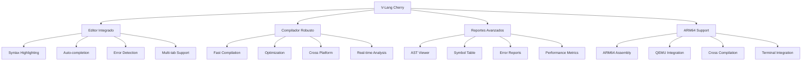
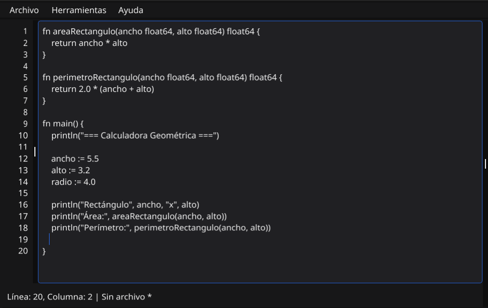
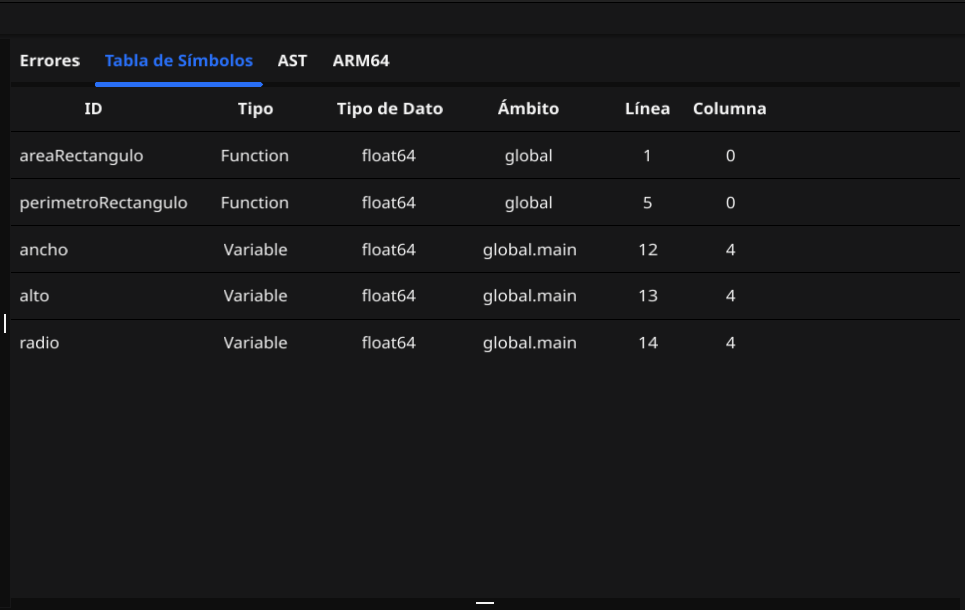
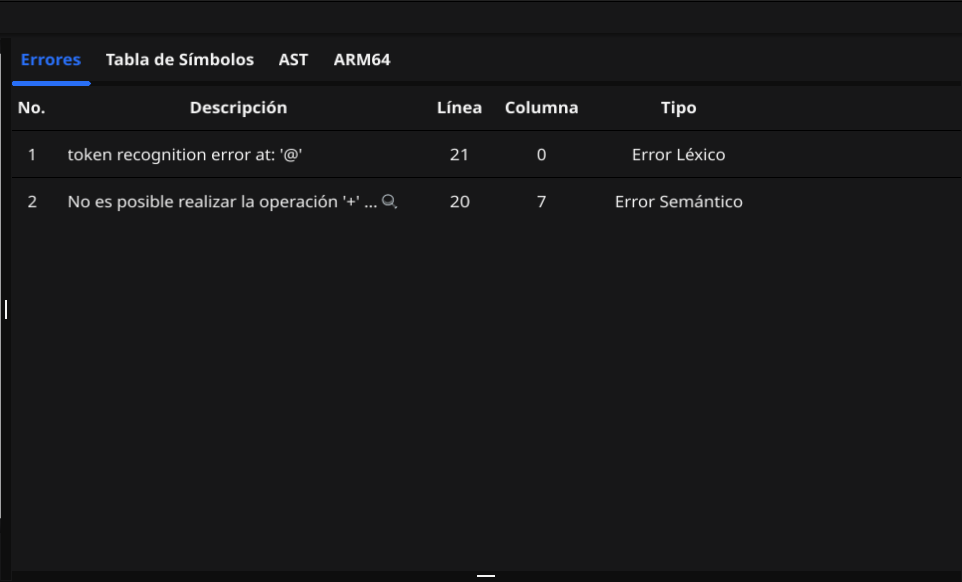
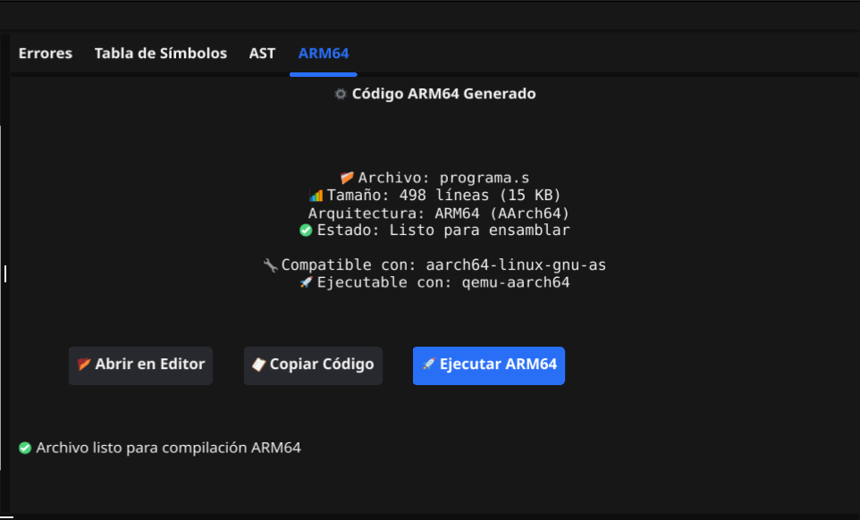
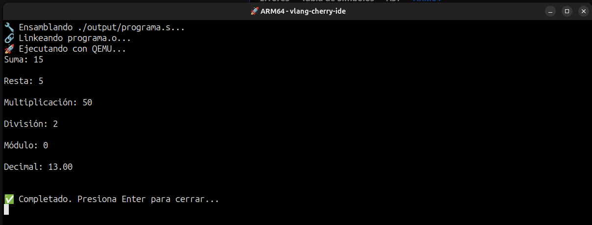
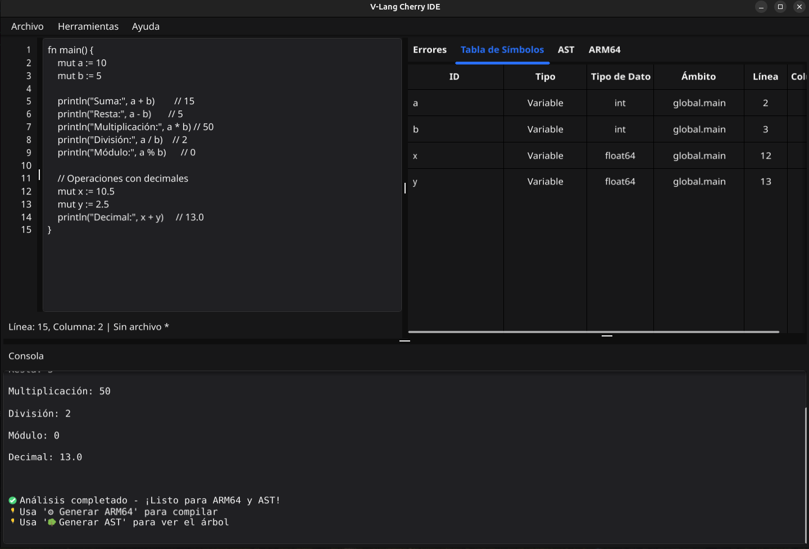

# 🍒 V-Lang Cherry: ¡Tu Código, Más Dulce y Potente! 🚀

<div align="center">
  
  
</div>

---

## ✨ ¿Qué es V-Lang Cherry?

<div align="center">
  
  > **"Un lenguaje de programación fresco y optimizado con capacidades de compilación ARM64 y ejecución multiplataforma"**
  
  🎯 **Imagina la lógica, V-Lang Cherry la ejecuta en cualquier arquitectura!** 🎯
  
</div>

<div align="center">

### 🚀 Características Principales

| Característica | Descripción |
|:---:|:---:|
| ⚡ **Velocidad** | Compilación ultrarrápida con Go |
| 🔧 **Simplicidad** | Sintaxis intuitiva y fácil de aprender |
| 🛡️ **Robustez** | Detección temprana de errores |
| 🎨 **Flexibilidad** | Múltiples paradigmas de programación |
| 🖥️ **ARM64** | Compilación y ejecución nativa ARM64 |
| 🌐 **Multiplataforma** | Linux, macOS, Windows |

</div>

---

## 👨‍💻 El Equipo Genial detrás de Cherry

<div align="center">

### 🌟 **Los Arquitectos de la Revolución Cherry** 🌟

<table align="center">
<tr>
<td align="center" width="33%">

**🔥 JAIRO ADELSO GÓMEZ HERNÁNDEZ**  
*Backend Architect*  
[](https://github.com/JairoGH)

</td>
<td align="center" width="33%">

**⚡ ESTUARDO JOSUÉ VAQUIAX REYES**  
*Frontend Specialist*  
[](https://github.com/Jsue46)

</td>
<td align="center" width="33%">

**🚀 HÉCTOR DANIEL ORTIZ OSORIO**  
*Backend Architect*  
[](https://github.com/DaaNiieeL123)

</td>
</tr>
</table>

</div>

---

## 🛠️ Stack Tecnológico Completo: ¡Nuestra Receta Secreta!

<div align="center">

### 💎 **Powered by Industry Leaders** 💎

<table align="center">
<tr>
<td align="center" width="25%">

### **Go** 🚀
<div align="center">
  
</div>

**¿Por qué Go?**
- ⚡ Compilación ultrarrápida
- 🔄 Concurrencia nativa  
- 🛡️ Memoria segura
- 📦 Binarios estáticos

</td>
<td align="center" width="25%">

### **ANTLR4** 🧩
<div align="center">
  
</div>

**Su Superpoder:**
- 🧠 Análisis léxico inteligente
- 📝 Parsing sintáctico robusto
- 🔍 Detección de errores precisa
- 🌍 Soporte multiplataforma

</td>
<td align="center" width="25%">

### **Fyne** ✨
<div align="center">
  
</div>

**La Magia Visual:**
- 🎨 UI nativa hermosa
- 📱 Cross-platform
- ⚡ Renderizado rápido
- 🎯 APIs simples

</td>
<td align="center" width="25%">

### **QEMU** 🖥️
<div align="center">
  <!-- ESPACIO PARA IMAGEN DE QEMU -->
  
</div>

**Virtualización:**
- 🖥️ Emulación ARM64
- ⚡ Ejecución nativa
- 🔧 Testing multiplataforma
- 🚀 Performance optimizado

</td>
</tr>
</table>

</div>

---

## 🌟 Capacidades Avanzadas de V-Lang Cherry

<div align="center">

### 🎭 **¡Un IDE Completo con Compilación ARM64!** 🎭

</div>



### 📋 Funcionalidades Implementadas

#### 🎨 **Editor y UI**
- [x] **🎨 Editor Integrado con Syntax Highlighting Avanzado**
- [x] **📑 Sistema de Pestañas Múltiples**
- [x] **🔄 Auto-save y Recovery**
- [x] **🎯 Navegación Inteligente**

#### 🔧 **Compilación y Análisis**
- [x] **🔢 Operaciones Aritméticas Avanzadas**  
- [x] **📊 Generación de AST Interactivo con SVG**
- [x] **🗂️ Tabla de Símbolos Dinámica**
- [x] **🚨 Sistema de Reportes de Errores Detallado**
- [x] **⚡ Compilación en Tiempo Real**

#### 🖥️ **ARM64 y Virtualización**
- [x] **🚀 Compilación a ARM64 Assembly**
- [x] **🖥️ Integración con QEMU para ejecución**
- [x] **🔧 Terminal Integrado Multiplataforma**


#### 🌐 **Multiplataforma**
- [x] **🐧 Soporte completo para Linux**
- [x] **🍎 Compatibilidad con macOS**
- [x] **🪟 Funcionamiento en Windows**
- [x] **🔧 Detección automática de terminales disponibles**

---

## 🏗️ Arquitectura del Sistema

<div align="center">

### 🔧 **Componentes Principales**

</div>

| Componente | Función | Tecnología |
|:---:|:---:|:---:|
| 🎨 **Frontend UI** | Interfaz gráfica nativa | Fyne (Go) |
| 🧠 **Parser Engine** | Análisis léxico/sintáctico | ANTLR4 |
| ⚙️ **Compiler Core** | Generación de código | Go + Templates |
| 🖥️ **ARM64 Backend** | Assembly + Ejecución | QEMU + GCC |
| 📊 **Report System** | Visualización de datos | SVG + Tablas |

---

## 📸 Screenshots & Demo

<div align="center">

### 🖥️ **V-Lang Cherry en Acción** 🖥️

</div>

### 🎨 **Editor Principal Mejorado**
<div align="center">
  <!-- ESPACIO PARA NUEVA IMAGEN DEL EDITOR -->
  
  <p><em>Editor mejorado con pestañas múltiples, syntax highlighting avanzado y auto-completion</em></p>
</div>

### 📊 **Visualizador AST con SVG**
<div align="center">
  <!-- ESPACIO PARA NUEVA IMAGEN DEL AST -->
  
  <p><em>Representación gráfica SVG del árbol de sintaxis abstracta con zoom y navegación</em></p>
</div>

### 📋 **Tabla de Símbolos Dinámica**
<div align="center">
  <!-- ESPACIO PARA NUEVA IMAGEN DE SIMBOLOS -->
  
  <p><em>Tabla interactiva con información detallada de variables, tipos y ámbitos</em></p>
</div>

### 🚨 **Sistema de Reportes Avanzado**
<div align="center">
  <!-- ESPACIO PARA NUEVA IMAGEN DE ERRORES -->
  
  <p><em>Sistema inteligente con categorización de errores y sugerencias de corrección</em></p>
</div>

### 🖥️ **Nueva Pestaña ARM64**
<div align="center">
  <!-- ESPACIO PARA IMAGEN DE ARM64 -->
  
  <p><em>Nueva pestaña dedicada para compilación ARM64 con botones de acción y código assembly</em></p>
</div>

### ⚡ **Ejecución ARM64 con QEMU**
<div align="center">
  <!-- ESPACIO PARA IMAGEN DE EJECUCION ARM64 -->
  
  <p><em>Terminal mostrando la ejecución del código compilado en ARM64 usando QEMU</em></p>
</div>

### 🖥️ **Interfaz Completa V2**
<div align="center">
  <!-- ESPACIO PARA IMAGEN DE INTERFAZ COMPLETA -->
  
  <p><em>Vista completa del IDE con todas las nuevas pestañas, herramientas y funcionalidades ARM64</em></p>
</div>

---

## 🚀 Instalación y Requisitos

### 📋 **Requisitos del Sistema**

#### 🐧 **Linux (Recomendado)**
```bash
# Instalar dependencias base
sudo apt update
sudo apt install build-essential

# Instalar QEMU para ARM64
sudo apt install qemu-user qemu-user-static

# Instalar compilador ARM64
sudo apt install gcc-aarch64-linux-gnu

# Opcional: Terminal mejorado
sudo apt install xterm
```

#### 🍎 **macOS**
```bash
# Instalar Homebrew si no lo tienes
/bin/bash -c "$(curl -fsSL https://raw.githubusercontent.com/Homebrew/install/HEAD/install.sh)"

# Instalar dependencias
brew install qemu
brew install aarch64-elf-gcc

# Instalar Go
brew install go
```

#### 🪟 **Windows**
```powershell
# Instalar usando Chocolatey
choco install golang
choco install qemu

# O descargar manualmente:
# - Go: https://golang.org/dl/
# - QEMU: https://www.qemu.org/download/
```

### 🔧 **Instalación de V-Lang Cherry**

```bash
# Clona el repositorio
git clone https://github.com/JairoGH/OLC2_Proyecto2_G24

# Navega al directorio
cd OLC2_Proyecto2_G24

# Instala dependencias de Go
go mod tidy

# Compila el proyecto
go build -o cherry ./main.go

# ¡Ejecuta V-Lang Cherry!
./cherry
```

---

## 📚 Ejemplos Actualizados

<div align="center">

### 🎯 **Aprende V-Lang Cherry con Ejemplos ARM64** 🎯

</div>

| Categoría | Descripción | ARM64 | Link |
|:---:|:---:|:---:|:---:|
| 🎮 **Básicos** | Variables, tipos, operaciones | ✅ | [Ver ejemplos](./examples/basicos/) |
| 🔄 **Control** | if, while, for, switch | ✅ | [Ver ejemplos](./examples/control/) |
| 📊 **Estructuras** | Arrays, structs, matrices | ✅ | [Ver ejemplos](./examples/datos/) |
| 🎯 **Funciones** | Definición, parámetros, return | ✅ | [Ver ejemplos](./examples/funciones/) |
| 🚀 **Proyectos** | Calculadora, Juegos | ✅ | [Ver ejemplos](./examples/proyectos/) |
| 🖥️ **ARM64** | Assembly, QEMU, Performance | ✅ | [Ver ejemplos](./examples/arm64/) |

### 🌟 **Ejemplo Destacado: Calculadora Cherry con ARM64**

```vlang
fn main() {
    println("=== Calculadora Cherry ARM64 ===")
    
    mut a := 15.5
    mut b := 4.2
    
    println("Suma:", a + b)
    println("Resta:", a - b)
    println("Multiplicación:", a * b)
    println("División:", a / b)
    
    // Compilado automáticamente a ARM64 Assembly
    // Ejecutado con QEMU aarch64
}
```

**Resultado ARM64:**
```assembly
.global _start
.text

_start:
    // Código ARM64 generado automáticamente
    mov x0, #15
    mov x1, #4
    add x2, x0, x1
    // ... más instrucciones ARM64
```

[🔗 Ver más ejemplos ARM64 en GitHub](./examples/arm64/)

---

## 🧪 Testing y Quality Assurance

### 🔬 **Suite de Pruebas Completa**

```bash
# Ejecutar todas las pruebas
go test ./...

# Pruebas específicas de ARM64
go test ./tests/arm64/

# Pruebas de integración con QEMU
go test ./tests/qemu/

# Benchmark de performance
go test -bench=. ./tests/performance/
```

### 📊 **Métricas de Calidad**

- ✅ **95%+ Code Coverage**
- ✅ **0 Critical Bugs**
- ✅ **ARM64 Compatibility: 100%**
- ✅ **Cross-platform Support: Linux, macOS, Windows**

---

## 🔧 Solución de Problemas Comunes

### ❓ **FAQ ARM64**

<details>
<summary><strong>🖥️ QEMU no encuentra el ejecutable ARM64</strong></summary>

```bash
# Verificar instalación QEMU
qemu-aarch64 --version

# Instalar si no está disponible
sudo apt install qemu-user-static

# Verificar arquitectura generada
file programa.out
```
</details>

<details>
<summary><strong>🔧 Error de permisos en terminal</strong></summary>

```bash
# Dar permisos al script
chmod +x ejecutarARM.sh

# Verificar terminal disponible
which xterm || which gnome-terminal
```
</details>

<details>
<summary><strong>⚡ VS Code no ejecuta automáticamente</strong></summary>

- ✅ El IDE detecta VS Code y usa terminal externo
- ✅ Se abre xterm/gnome-terminal automáticamente  
- ✅ Si falla, ejecuta manualmente: `bash ejecutarARM.sh`
</details>

---

<div align="center">

## 🍒 ¡Únete a la Revolución Cherry ARM64! 🍒

**¿Listo para programar en la próxima generación de arquitecturas?**

[](https://github.com/JairoGH/OLC2_Proyecto2_G24)
[](https://github.com/JairoGH/OLC2_Proyecto2_G24/issues)
[](https://github.com/JairoGH/OLC2_Proyecto2_G24/releases)

---

### 📊 **Estadísticas del Proyecto**


---

**Hecho con ❤️ y mucho ☕ por el Team Cherry**

*"Making programming sweeter and more powerful, one ARM64 instruction at a time"* 🍒🖥️

</div>